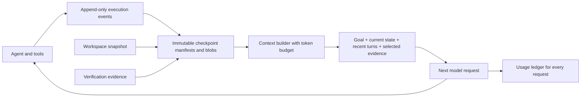

**StateTree research and build guide — 20 September 2026**

This document records the research and code audit before implementation. The local MVP has since been implemented; see the [README](../README.md) for current behavior, commands and limitations.

Your objective is to reduce the tokens consumed by long-running AI agents while preserving their ability to finish tasks. The Git analogy is useful for versioning, branching and recovery. The token-saving mechanism must be a separate component that chooses what the model sees at each step.

Recommended project description: **StateTree is a versioned execution-state layer that resumes agents from compact, evidence-backed context and measures the total cost of completing their tasks.** Framework portability is a later milestone; the existing Strands adapter is a sensible first implementation.

This guide combines inspection of the current repository with primary research papers and official documentation. Proposed architecture and evaluation targets below are recommendations, not implemented features or measured StateTree results.

**Read these papers in this order.**

| Priority | Primary paper | What it contributes | Application to StateTree |
| --- | --- | --- | --- |
| 1 | [Beyond Semantic Organization: Memory as Execution State Management for Long-Horizon Agents / MAGE](https://arxiv.org/abs/2606.06090), June 2026 | A hierarchical state tree; active-path context; Grow, Compress, Maintain and Revise operations. | Closest research foundation for versioned subgoals, validated summaries and abandoning flawed trajectories. |
| 2 | [The Complexity Trap: Simple Observation Masking Is as Efficient as LLM Summarization for Agent Context Management](https://arxiv.org/abs/2508.21433), August 2025 | Compares dropping older tool observations with LLM summarization in SWE-agent on SWE-bench Verified. | Implement cheap, deterministic masking as the first compression baseline. |
| 3 | [SKILL.state: Scalable Long-Horizon Agent Skills](https://arxiv.org/abs/2608.26263), August 2026, revised September 2026 | Replaces growing history with a fixed procedure, structured current state and the newest observation. | Validate state patches and construct each prompt from explicit state. Particularly relevant to cumulative token reduction. |
| 4 | [AgentFold: Long-Horizon Web Agents with Proactive Context Management](https://arxiv.org/abs/2510.24699), October 2025 | Learns to condense trajectories at different levels, including completed subtasks. | Fold completed subgoals into summaries with references to their original evidence. |
| 5 | [Remember When It Matters: Proactive Memory Agent for Long-Horizon Agents](https://arxiv.org/abs/2607.08716), July 2026 | A separate memory agent maintains structured state and selectively injects reminders. | Retrieve a relevant constraint or failed-attempt lesson only when it affects the next decision. |
| 6 | [MemGPT: Towards LLMs as Operating Systems](https://arxiv.org/abs/2310.08560), October 2023, revised February 2024 | Separates limited model context from larger external memory using managed movement between memory tiers. | Keep a small working state and retrieve archived evidence when needed. |
| 7 | [MemoryArena: Benchmarking Agent Memory in Interdependent Multi-Session Agentic Tasks](https://arxiv.org/abs/2602.16313), February 2026 | Tests whether memory supports later actions across dependent tasks and sessions. | Evaluate task completion after compaction and restart, not just recall of saved facts. |
| 8 | [Agent Memory: Characterization and System Implications of Stateful Long-Horizon Workloads](https://arxiv.org/abs/2606.06448), June 2026 | Profiles construction, retrieval and generation costs across memory systems. | Meter the whole memory lifecycle so savings in one stage do not hide overhead elsewhere. |

The MAGE abstract supports the brief's reported **55.1% token reduction and 7.8–20.4 percentage-point success improvements** in its MemoryArena experiments. The token result is a task-count-weighted aggregate versus Long Context; savings vary by domain. The paper does not separately itemize auxiliary memory-call tokens or dollar cost. These are authors' results for their evaluated configurations, not a prediction for StateTree. Its execution-state tree is strong prior art; neither the tree nor Git-like branching alone establishes originality. [MAGE paper](https://arxiv.org/abs/2606.06090)

The Complexity Trap reports that observation masking roughly halves cost against an unmanaged agent in its evaluated setting and can match summarization's solve rate. This supports starting with a simple baseline; it does not establish that masking is best for every task or that dollar savings equal token savings. AgentFold also involves training, so its results cannot be reproduced merely by adding a summary function. [Complexity Trap](https://arxiv.org/abs/2508.21433), [AgentFold](https://arxiv.org/abs/2510.24699)

SKILL.state is especially useful for your state schema. It reports lower cumulative token use with explicit state, including public-task evaluations. Its approach relies on retaining the information future steps need; a badly chosen schema or incorrect update can discard something essential. Use validated patches and retain an external audit archive before trying aggressive history removal. [SKILL.state paper](https://arxiv.org/abs/2608.26263)

The proactive-memory paper supports the brief's +8.3 and +6.8 percentage-point pass@1 claims on Terminal-Bench and tau-squared-Bench for its Sonnet 4.5 action agent plus Opus 4.6 memory configuration. These are reliability gains, not evidence of net token reduction. A memory agent introduces extra inference; measure its construction and intervention costs before adding it to the default path. [Proactive Memory paper](https://arxiv.org/abs/2607.08716)

**Existing systems substantially overlap with the idea.**

| System | Existing capability | Implication for your project |
| --- | --- | --- |
| [Strands snapshots](https://strandsagents.com/docs/user-guide/concepts/agents/snapshots/) and [session management](https://strandsagents.com/docs/user-guide/concepts/agents/session-management/) | Serializable agent snapshots, session persistence and immutable snapshot history. | Reuse these through your adapter; persistence alone is not your token-saving contribution. |
| [Strands context management](https://strandsagents.com/docs/user-guide/concepts/context-management/) | Ordered context-reduction strategies, automatic and agentic modes, and retrieval of archived content. | Benchmark against the built-in automatic mode. A custom compressor must add measurable value. |
| [LangGraph persistence](https://docs.langchain.com/oss/python/langgraph/persistence) | Checkpoints for continuity, time travel and fault tolerance. | Treat it as prior art and a potential later adapter. |
| [Letta MemFS](https://docs.letta.com/concepts/memfs) | Git-backed agent memory; selected files are always in context, others are read on demand; versioning and worktrees. | “Git for agent memory” already exists. Focus your pitch on the particular execution-state contract and measured results. |
| [Deep Agents summarization implementation](https://github.com/langchain-ai/deepagents/blob/main/libs/deepagents/deepagents/middleware/summarization.py) | Summarization with history offloading and later retrieval. | Useful implementation reference and comparison for lossy summary-based context reduction. |

My assessment is that StateTree can be useful by combining compact recovery with workspace alignment, branch-scoped evidence, explicit verification and transparent accounting. This is a proposed engineering contribution, not a claim that no other project combines these features.

**Your current repository is a checkpoint prototype.**

The existing [invariants](STATETREE_SPEC.md) already identify bounded context, provenance, deterministic compaction and selective injection. The implementation currently covers only part of those requirements. The local virtual environment contains `strands-agents 1.56.0`; its installed `Agent` constructor exposes `context_manager`, so the built-in baseline is relevant to this checkout.

| Location | Observation | Why it matters |
| --- | --- | --- |
| [core/commit.py](../statetree/core/commit.py) | `created_at` appears in `payload` and is also passed explicitly in `cls(..., created_at=created_at, **payload)`. | Commit creation raises a duplicate-keyword `TypeError`; repair this before the recovery demo. |
| [runtime/runtime.py](../statetree/runtime/runtime.py) | Saves a `session` snapshot and later reloads it. No bounded-context assembly, compaction or usage ledger is implemented here. | Saving and restoring history does not itself reduce future model input. |
| [core/commit.py](../statetree/core/commit.py) and [runtime/runtime.py](../statetree/runtime/runtime.py) | The ID is computed before the snapshot path is changed, and the snapshot's bytes are not hashed into the manifest. | The ID is not a content-integrity check for the final persisted checkpoint. |
| [storage/local.py](../statetree/storage/local.py) | One global HEAD, ordinary file writes and no compare-and-swap transaction. | A branch label does not provide independent branch heads or concurrent-write protection. |
| [runtime/runtime.py](../statetree/runtime/runtime.py) | Uses a shared `pending.json`; `verified=True` is supplied by the caller. | Concurrent commits can collide, and verification currently has no stored evidence contract. |
| [workspace/git.py](../statetree/workspace/git.py) | Uses `git stash create` for tracked workspace changes. Restore writes the same snapshot into both index and worktree. | Untracked files are outside this snapshot; original staging is not preserved. Created stash objects need a durable Git reference to remain reachable. |
| [runtime/runtime.py](../statetree/runtime/runtime.py) | Restore changes the workspace before reading and loading the agent snapshot; store location defaults to the current directory. | Preflight validation and explicit store/repository binding are needed for reliable recovery. |
| [examples/checkpoint_restore.py](../examples/checkpoint_restore.py) | Changes an agent state value and one file; does not invoke the model. | It can demonstrate restoration, but cannot demonstrate token savings or resumed task success. |

Git documents `stash create` as creating a dangling commit without storing it in the ref namespace. Pinning a checkpoint's Git object is a persistence requirement. A tracked-file snapshot also does not restore a database, remote API, browser session or running process. [Git stash documentation](https://git-scm.com/docs/git-stash)

The duplicate-keyword failure was reproduced directly without invoking a model. An isolated temporary Git repository also confirmed tracked-file restoration and the untracked/index limitations. No model-based token benchmark was run for this research. Add a dependency manifest and a reproducible smoke test when implementing the first repairs.

**The architecture should separate durable history from model input.**

This is a proposed structure. Keep three concepts distinct: the checkpoint graph records ancestry; structured state records what currently holds; the context builder selects a bounded view for a particular decision. Traversing and including the entire root-to-HEAD path can still grow without limit. Hierarchical rollups and a final token check are needed.

Use immutable blobs addressed by full content hashes. A checkpoint manifest should reference its parent or parents, schema version, goal and active subgoal, structured facts with evidence references, pending actions, transcript/archive references, workspace snapshot, verification results, and adapter/model/tool configuration fingerprints. Hash the final canonical manifest with its ID field excluded. Keep usage as append-only records linked to run, branch and checkpoint IDs; include work performed on discarded branches.

For the local MVP, SQLite can hold branch references and transactional metadata while files hold immutable blobs. Advance a branch reference only if its expected parent still matches. A recovery checkpoint may contain unverified work; promotion to canonical verified state should be a separate operation. Otherwise, crashes force loss of useful progress between verified milestones.

**Build the token-saving component around an explicit budget.**

1. Archive each complete tool result before shortening it. Store a stable reference and enough metadata to retrieve the original.
2. Preserve the user goal, hard constraints, active subgoal, unresolved actions and necessary recent tool-call/result pairs.
3. Replace old bulky observations with small deterministic records: tool name, arguments or argument reference, exit status, salient outcome and artifact reference. Remove duplicate output and superseded facts before invoking another model.
4. Select verified facts by active subgoal and dependencies. Exclude irrelevant branch traces. Preserve a concise failed-attempt lesson when it prevents the same mistake.
5. If necessary, summarize a completed subgoal into structured fields: outcome, decisions, evidence, remaining obligations and uncertainty. Record the source span so the summary can be checked and expanded.
6. Count the final serialized request, including system instructions and tool schemas. Reserve output capacity. If required information alone exceeds the budget, split the task or report the constraint; do not silently discard it.
7. Retrieve archived details only when needed. Meter the extra retrieval turns and any model-based ranking or summarization.

A starting budget such as 6,000 tokens is an experiment setting, not a universal optimum. Keep the same budget across comparable variants and sweep a few sizes after the first working benchmark. Preserve valid provider message structure when masking tool output.

For intuition, suppose 50 calls each add 1,000 tokens of retained history. Replaying growing history costs approximately `1,000 × (1 + ... + 50) = 1,275,000` input tokens. A 6,000-token cap would bound those 50 inputs at 300,000 tokens. This is an illustration excluding other costs, not a forecast: summaries, extra steps, retries and failures can erase the apparent saving.

Git delta storage saves disk space. It saves model tokens only when it changes the materialized prompt. A model receiving a delta still needs the relevant base state or a way to retrieve it. Similarly, prompt caching can reduce billed cost and latency while retaining the same logical context; track it separately. [Amazon Bedrock prompt caching](https://docs.aws.amazon.com/bedrock/latest/userguide/prompt-caching.html)

**Make the first benchmark answer a narrow question.**

Research question: *Does branch-aware structured context reduce total inference tokens per completed coding task compared with existing Strands context management, without materially reducing success?*

Use the same model, model settings, tools, task limits and starting repository for each variant:

| Variant | Purpose |
| --- | --- |
| Full history, with an explicit overflow policy | Unmanaged baseline; record overflows as failures. |
| Installed Strands automatic context management | Practical baseline against an existing solution. |
| Deterministic observation masking | Test the cheap first intervention. |
| Masking plus structured state and selective evidence | Main StateTree hypothesis. |
| Previous variant plus LLM subgoal summaries | Isolate whether summarization pays for itself. |

Begin with 10–20 fixed, multi-step repository tasks and several repeated runs where affordable. Include a noisy-log task, a failed-attempt detour, a task that needs an old detail after compaction, and a restart in a fresh process. Use deterministic task checks plus requirement checks. A passing test suite is evidence for its tested properties, not proof that every saved statement is true. Later evaluate a disclosed subset of MemoryArena or SWE-bench Verified; a small custom suite cannot support a benchmark-wide claim.

Record task success, total input/output tokens across all model calls, memory-management tokens, verification tokens, retries, discarded-branch tokens, cache counters, wall time, tool calls and recovery correctness. Store provider raw usage alongside normalized counters. Provider cache accounting differs; do not blindly add cached tokens to input totals or count cumulative SDK metrics repeatedly. Strands exposes usage and cache metrics in `AgentResult.metrics`. [Strands metrics documentation](https://strandsagents.com/docs/user-guide/observability-evaluation/metrics/)

Report both success rate and total tokens across all attempts divided by successful tasks. Include failed attempts in the numerator; if there are zero successes, report the ratio as undefined. Report per-task distributions and uncertainty when possible. Dollar cost is a separate metric with the model, pricing date and cache treatment stated.

A reasonable provisional MVP target is at least 30% fewer total tokens with no more than a 5-percentage-point success drop against the practical baseline. These are proposed acceptance criteria, not expected results. A small suite may not resolve a 5-point difference; report that limitation rather than declaring equivalence.

For recovery, inject crashes before and after tool completion and checkpoint publication. Verify workspace alignment, restored state, retained evidence and whether completed effects repeat. An idempotency key and effect receipt help, but a crash after an external action succeeds and before its receipt is saved creates an uncertain outcome. Reconcile with the external service rather than automatically repeating it. LangGraph's documentation similarly requires attention to effects that rerun on resume. [LangGraph interrupts and side effects](https://langchain-ai.github.io/langgraph/concepts/breakpoints/)

**Implement in this order.**

| Stage | Work | Evidence required before expanding scope |
| --- | --- | --- |
| 1. Reliable checkpoint kernel | Correct construction and hashing; explicit store root; durable workspace references; preflight restore; atomic branch updates. | A fresh process restores a complete, validated checkpoint; incomplete writes do not advance a branch. |
| 2. Usage ledger and baseline runner | Capture every request and compare full-history with built-in Strands behavior. | Reproducible per-task token and success reports, with no model calls omitted. |
| 3. Bounded context | Archive tool output, mask old observations, retain structured state and retrieve evidence. | Lower measured total usage at an acceptable success rate. |
| 4. Branch and verification workflow | Isolated workspaces, independent branch heads, scoped verification evidence and explicit promotion. | Failed branches cannot silently change another branch's files or canonical state. |
| 5. Portability and deployment | A second adapter, then remote storage and workers if needed. | A documented subset of state transfers correctly; unsupported tool or environment state is rejected explicitly. |

Candidate modules for later implementation are `core/state.py`, `context/builder.py`, `context/compaction.py`, `runtime/usage.py`, `verification/`, `adapters/strands.py` and `benchmarks/`. Keep the existing runtime API small and let each component have one clear responsibility.

Parallel speculative agents should come after the single-agent benchmark. Every explored branch consumes tokens, even when its files are cheaply shared. Model switching should also come later: serialized state can transfer explicit facts and plans, but does not transfer model hidden state or guarantee equivalent behavior. Start with local storage and your existing Strands environment; distributed workers and a dashboard should follow demonstrated savings.

The first convincing demo is one task run under both baselines and StateTree, with a fresh-process restart, matching task checks, and a chart of **cumulative actual tokens**. Show active-context size separately. The brief's example of 92,481 history tokens versus 4,814 active tokens is a compression illustration; it cannot establish 94.8% end-to-end token savings.
